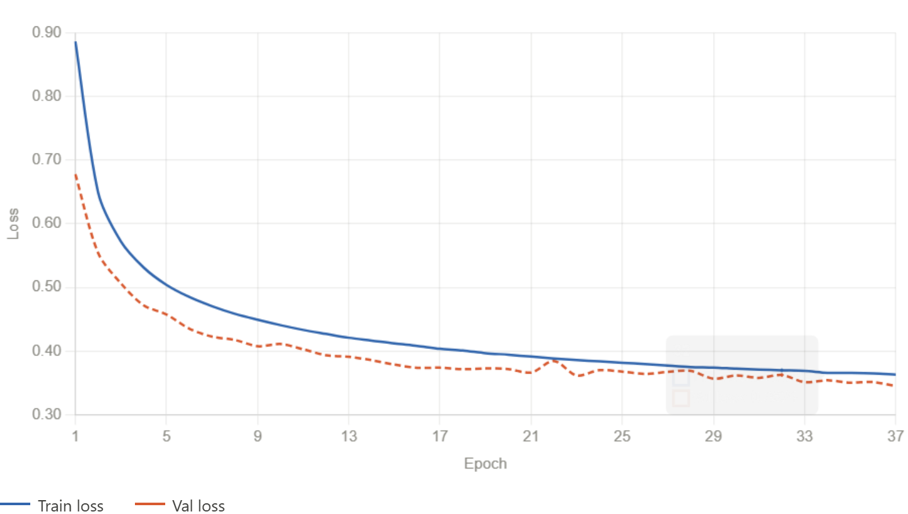

# Final Presentation
---
## Project Overview
---
### The Problem
- Modern chess engines excel at calculating optimal moves but often fail to explain *why* those moves are strong in terms that humans understand.
- This means chess players potentially spend hours analyzing why a move works
---
### The Solution
- Motif Detection through a Neural Network
- Analysis becomes much easier to do when motifs are known
---
## Summary
---
### Sprint 1
- Week 4: Set up project, initial research.
- Week 5: Docker, WSL2 and PyTorch setup
- Week 6: Documentation created for running project files, setting up environment, initial neural network
- Week 7: main.py created for users, additional manual testing, and updating the neural network.
---

---
### Sprint 2
- Week 10: Increased input to allow more information and increased output to all motifs
- Week 11: Trained on full dataset and final input
- Week 12: Stockfish Integration
- Week 13: Terminal Output Improvements
- Week 14: Deployment and final improvements/bug fixing
---
### Key Numbers - Total Project
- LoC: 1544
- Requirements: 14 out of 14
- Features: 4 out of 4
- Final Macro F1 score of .60
---
### Conclusion

---
## Retrospective
---
### What went wrong
- Model Kept Overfitting
  - I used a randomly 10k subset of the dataset
  - This meant that some motifs couldn't be learned
---
### What went well
- I learned a lot of different regularization techniques
- When I used the entire dataset to to train the model, the overfitting problem disappeared.
---
### Improvement plan
- Continue working consistently
- Fix CPU bottleneck problem
---
#### Questions?